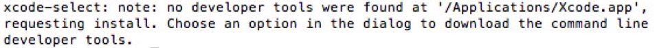
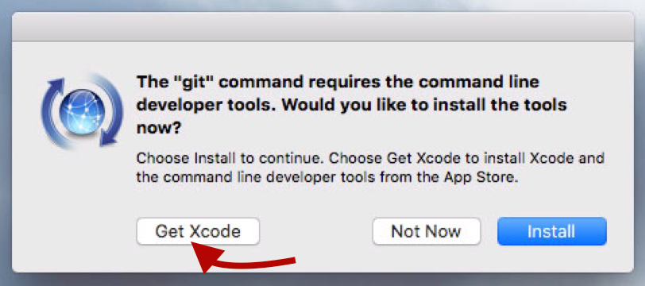

# Mac Build (using Ansible)
*Automating OS X setup from the ground up*


The goal of this fork is fully automate configuring an OS X El Capital iOS 
build machine using Ansible.  I am currently reviewing and timing back the 
functionality of the [forked macbuild project](https://github.com/fgimian/macbuild).

###Steps followed
- Erase hard drive and boot from OS X installer to ensure a consistent 
initial starting point. (more detailed instructions:
[installer creation](http://osxdaily.com/2015/09/30/create-os-x-el-capitan-boot-install-drive/) and [full wipe / reinstall](http://osxdaily.com/2015/10/01/clean-install-os-x-el-capitan-mac/))
- Generate system prompt to install Xcode and developer tools
  - `git init && rm -r .git` 
  - Message returned in the command line:
  - System prompt: (select get xcode)
- View and accept the Xcode agreenment:
  - Cause accept prompt to be returned: `sudo git init && rm -r .git`
  - Enter `q` and `accept` when ptompted, to indicate your acceptance
- `git clone https://github.com/aln787/macbuild.git`
- `cd macbuild && git checkout elCapitan`
- `./macbuild`


## Building the System

Run the following in your Terminal to use my configuration:

```bash
cd macbuild #repo cloned above
git pull && git checkout elCapitan
./macbuild.sh
```

It is strongly suggested that you reboot your Mac after the first run
of this.

## Manual Configuration

Some settings (outside those in the "Out of Scope") section must be set 
manually due to excessive automation complexity.

* **Chrome**: Sign in with your Google account to sync settings

## Notes

* **OS X Defaults**: Updating of plist properties for various aspects of OS X 
  such as enabling zoom, configuring Finder and so on.  This uses a custom
  plist module which allows for complex updates of plist files far beyond
  the defaults command.
* **Configuration Files**: Any files that are to be copied to the Mac, 
  including app settings, licenses and dotfiles.
* **Symlinks to Cloud Storage**: This allows you to store certain app 
  configuration in the cloud (e.g. Dropbox, Google Drive .etc) and then
  symlink to it so that your settings are stored and updated in the cloud.
* **Unix Package Installation**: This is being accomplish with the use of
  [homebrew](https://github.com/Homebrew/homebrew).
* **Desktop Application Installation**: This is being performed with the use
  of [homebrew-cask](https://github.com/caskroom/homebrew-cask).
* **Development Setup**: Installation of development languages and tools like Python, Ruby, Node.js, Fastlane,...
* **Application Settings**: Automating configuration of Sublime Text
* **Terminal Customisation**: Setting up the Terminal using JXA.
* **Appstore Application Check**: Since there is currently no way to automate
  installation of App Store applications, I perform a check to see if the app
  is installed, and notify the user that they must install it from the App 
  Store if it isn't.

The plist module is a modified version of
[Matthias Neugebauer's plist module](https://github.com/mtneug/ansible-modules-plist).

### Features

* **Handlers**: Implementation of handlers to avoid the reboot requirement
* **Finder**: Sidebar containing favourites and so forth
* **Dock**: Setup the Dock with the appropriate icons (via dockutil)
* **LaunchPad**: Setup Launchpad with the appropriate icons and structure
* **Notification Centre**: Set the order of items and allow permission
* **Git**: Further aliases and touch-ups to gitconfig (possibly 
  integrating cdiff)

## TODO

### Bugs

* The new version of Ansible (2.1) doesn't pass variables correctly to my plist module which leads to it failing
* Sudo keeps dropping out during installs due to Homebrew invalidating it

## References

### Projects

* [macbuild](https://github.com/fgimian/macbuild)
* [mac-dev-playbook](https://github.com/geerlingguy/mac-dev-playbook)
* [ansible-modules-plist](https://github.com/mtneug/ansible-modules-plist)
* [legacy-common](https://github.com/osxc/legacy-common)
* [custom-ansible-osx](https://github.com/mtneug/custom-ansible-osx)

### Frameworks

* [superlumic](https://github.com/superlumic/superlumic)
* [battleschool](https://github.com/spencergibb/battleschool)
* [osxc](http://osxc.github.io/)

### Blog Posts

* [Automating your development environment with Ansible](http://www.nickhammond.com/automating-development-environment-ansible/)
* [How to automate your Mac OS X setup with Ansible](https://blog.vandenbrand.org/2016/01/04/how-to-automate-your-mac-os-x-setup-with-ansible/)
* [Using Ansible to automate OSX installs via Superlumic](http://vanderveer.be/2015/09/27/using-ansible-to-automate-osx-installs-via-superlumic.html)
* [How to Bootstrap a new OS X Environment with Ansible](http://flounderedge.com/bootstrap-new-os-x-environment-ansible/)
* [Automation of Installation on Mac w/ Ansible](https://medium.com/@hackyGQ/automation-of-installation-on-mac-w-ansible-21354cce0d7b#.j7rujxwgc)

## License

Mac Build is released under the **MIT** license. Please see the
[LICENSE](https://github.com/fgimian/macbuild/blob/master/LICENSE) file for more details.  Feel free take what you like and use it in your own Ansible scripts.
